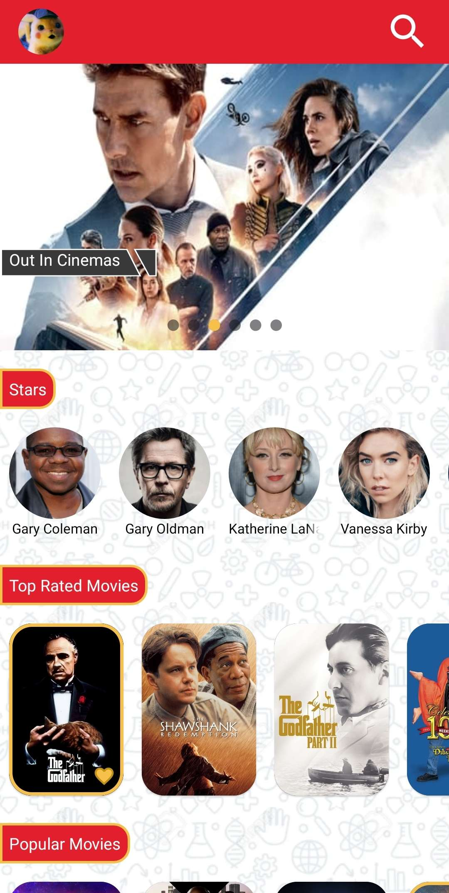
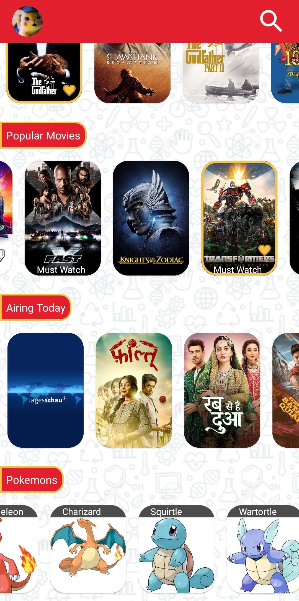
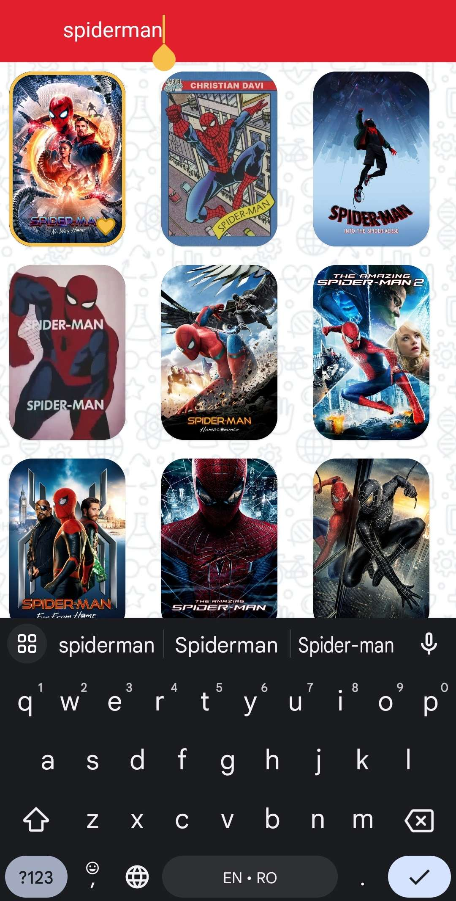
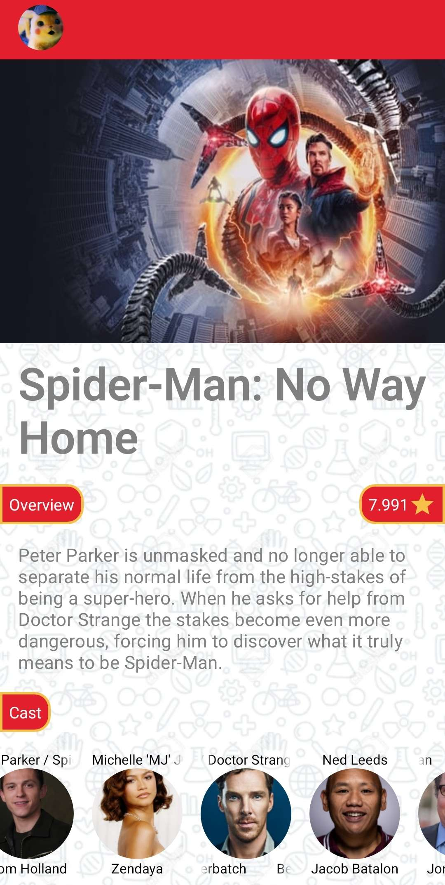

# Movies App

This is an Android Movies App that uses TMDb (The Movie Database) API to display various information about movies. It allows logging in with a TMDb account, viewing details of any movie, searching for any movie, and even adding movies to favorites. The app is written in Kotlin and uses the View System for UI. Other technologies used are Retrofit and GraphQL for networking, Room for persistence.

## Login

The login page has 2 text fields where the user inputs their username and password and then is able to login. After pressing the "Login" button, progress is displayed on the button while we wait for the login request to complete. A toast is shown if the user enters invalid credentials and login can be tried again.

After a succesful login, the app will remember the login and open the homepage directly.

## Homepage

The homepage consists of a pager displaying current popular movies and multiple lists showing various movies/TV shows and actors. Actor names that are too long slide across for readability.

Some movies have a "Must Watch" tag, this happens to movies released in the past 2 months.

Holding down on any of the movie cards adds a yellow border and heart to it, marking it as favorite. Using Room, the list of favorite movies is saved and persistent within the app and different sessions.

The topbar has an image of the currently logged in user's avatar (on the left) and a search icon button (on the right). Clicking the avatar will logout the user.

At the bottom of the homepage there is a list of pokemons because why not? This list is fetched using GraphQL (from https://graphql-pokeapi.vercel.app).

## Search

Clicking the search icon in the top right of the homepage sends the user to a screen where they can search any movie and after a small amount of time, results of movies related to their search will pop up. There is no "search" button, the search is done automatically after the user hasn't entered any new characters for 450 ms.

The user can add movies to their favorites from this screen as well.

There is also a dropdown with the past 10 searches when the first few letters are similar to those 10. This is saved in SharedPreferences.

## Details

Clicking a movie card (either in the homepage or the search screen) takes the user to a Details page. Here they can see an image representing the movie, a description of the movie, its rating and a list of the actors from the movie and the characters they played. Once again, actor names that are too long slide across for readability.
